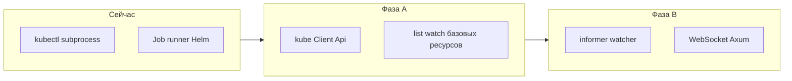

# 🎛️ Голландский Штурвал — План реализации Kubernetes UI

> **Долгосрочная цель:** максимально полное покрытие сценариев Kubernetes в Web UI (ориентир — эквивалент `kubectl` + хороший UX).  
> **MVP и промежуточные релизы** — явный scope по фазам ниже; «100%» не блокирует первый релиз модуля.  
> **Backend:** Rust (Axum + REST `/api/kubernetes/...`; kube-rs) | **Frontend:** Vanilla JS

---

## 📋 Оглавление

1. [Обзор проекта](#обзор-проекта) · [Killer features (кандидаты)](#killer-features)
2. [Архитектура](#архитектура)
3. [Текущее состояние репозитория](#текущее-состояние-репозитория)
4. [Эволюция клиента (kubectl → kube-rs)](#эволюция-клиента-kubectl--kube-rs)
5. [Безопасность и мульти-тенантность](#безопасность-и-мульти-тенантность)
6. [Референсные продукты и лучшие практики Web UI](#ref-web-ui-best-practices)
7. [Фазы реализации](#фазы-реализации)
8. [Детальный план по ресурсам](#детальный-план-по-ресурсам)
9. [Дополнительные ресурсы (outline)](#дополнительные-ресурсы-outline)
10. [API Reference](#api-reference)
11. [Frontend компоненты](#frontend-компоненты)
12. [Интеграции](#интеграции)
13. [Тестирование](#тестирование)
14. [KPI и нефункциональные требования](#kpi-и-нефункциональные-требования)
15. [Документация](#документация)
16. [Риски и митигация](#risks-mitigation)
17. [Инструменты разработки](#dev-tools)
18. [Checklist перед релизом](#release-checklist)
19. [Success Metrics](#success-metrics)
20. [Continuous Improvement](#continuous-improvement)
21. [Команда и коммуникация](#team-communication)
22. [Changelog](#changelog)
23. [Референсы](#референсы)
24. [Следующие шаги](#следующие-шаги)

---

## 🎯 Обзор проекта

### Цель
Создать **полнофункциональный Web UI для Kubernetes**, ориентируясь на **максимально полное покрытие** сценариев `kubectl` и хороший UX (как в шапке документа: **полный паритет с `kubectl` — долгосрочный ориентир**, не обязательный барьер для MVP). Заимствовать лучшие практики из:
- **Headlamp** — официальный Kubernetes SIG UI
- **Lens Desktop** — IDE для Kubernetes
- **Octant** — визуализация зависимостей
- **K9s** — terminal UX паттерны
- **Rancher** — enterprise управление

Детальный разбор референсов, индустриальных практик (dry-run, SSA, RBAC-UX) и **backlog пробелов** — в разделе [Референсные продукты и лучшие практики Web UI](#ref-web-ui-best-practices).

### Название
**"Голландский штурвал"** (Dutch Helm) — символизирует полный контроль над кластером, как капитан корабля управляет судном с помощью штурвала.

### Ключевые принципы
1. **Без обязательности CLI для пользователя** — типовые операции из UI; на стороне сервера допустимы `kubectl`/Helm CLI там, где это временно или осознанно ([эволюция клиента](#эволюция-клиента-kubectl--kube-rs)).
2. **Real-time** — WebSocket для live обновлений
3. **Visual First** — графы, топологии, диаграммы
4. **Safe by Default** — подтверждение деструктивных операций
5. **Multi-cluster** — управление несколькими кластерами (модель контекстов закладывается с **фазы 1**, полный UI — позже)

<a id="killer-features"></a>

### Потенциальные killer features (спрос и уникальность)

Ниже — **кандидаты** в отличительные возможности (не обязательно все в v1). Часть опирается на связку **Velum (задачи, проекты, аудит) + Kubernetes**, часть — на сильный UX вокруг сырых API. Приоритизация — отдельно (продукт, TAM, сложность).

| # | Название | Кому / зачем | Почему может быть уникальным |
|---|----------|----------------|--------------------------------|
| 1 | **Runbook из объекта кластера** | Ops,-support | Из Pod/Deployment/Node — запуск **шаблона Velum** с автоподстановкой namespace, имени, лейблов, контекста кластера. Обычный K8s UI не знает ваших playbook/task runner. |
| 2 | **Панель «Почему не работает»** | SRE, on-call | Одна **временная шкала**: Events + метрики + логи + **последние мутации из аудита Velum** со ссылками на ресурсы. Снижает время расследования. |
| 3 | **Промоушен образа с проверкой** | DevOps, release | Смена image/tag → dry-run → apply → **авто smoke-задача Velum** → при падении — явный путь **rollback** (Deployment/Helm). Связка кластера и CI/CD в одном продукте. |
| 4 | **«Приложение» (app lens)** | Devs, product teams | Агрегация Deployment+Service+Ingress+HPA+Config/Secret+PVC по **app** / ownerRefs; статус «сервиса», а не списка kind'ов. Ближе к ментальной модели команды. |
| 5 | **Пакеты политик платформы** | Platform, security | Одобренные пресеты **PSA + NetworkPolicy + Quota**; применение в namespace с **объяснением эффекта**. Governance как продукт, не только «вставь YAML». |
| 6 | **Визуальный конструктор NetworkPolicy** | Все, кто боится отрезать трафик | Граф ingress/egress + предупреждения; редко доведено до «человечного» уровня в OSS Web UI. |
| 7 | **Helm + пост-релизные задачи** | Релиз-инженеры | После upgrade — цепочка **задач Velum** (миграции БД, smoke, уведомления). Один контур: чарт и операции «после». |
| 8 | **Инвентарь ↔ кластер** | Ansible-пользователи Velum | Синхронизация/экспорт **нод, лейблов, групп** в инвентарь или метаданные шаблонов. Естественный мост с ядром продукта. |
| 9 | **YAML-редактор с schema кластера** | Все редакторы манифестов | Подсказки/валидация по **живому OpenAPI** apiserver + **dry-run**; уровень «explain», без ухода в документацию. |
| 10 | **FinOps «проекта»** | FinOps, руководители | Usage/оценка стоимости по namespace/лейблу + привязка к **проекту Velum** (OpenCost/Kubecost или упрощённая модель). |
| 11 | **Break-glass + аудит exec** | Enterprise, compliance | Временный доступ по тикету; **аудит** действий и опционально сессий exec; единая трассировка Velum + K8s. |
| 12 | **Drift между кластерами** | Platform teams | Сравнение одного workload/CR на **нескольких кластерах** (image, реплики, ключевые поля). |
| 13 | **Пакет «CRD UI + задача»** | Операторные стеки | Для выбранного CRD не только экран CR, но и **готовый шаблон задачи** (операции эксплуатации). Сильнее отдельного «плагина только UI». |
| 14 | **GitOps lite** | Команды с одним репозиторием | Статус sync, **diff** live vs declared, ручной sync под RBAC — без полноценного второго продукта уровня Argo CD UI. |

**Заметка:** паритет с `kubectl` и таблицы ресурсов — **гигиена**; пункты таблицы выше — кандидаты в **историю «зачем выбрать Velum для K8s»**. После выбора 1–2 направлений их стоит вынести в отдельные эпики с KPI (время расследования, доля релизов с smoke, adoption и т.д.).

---

## 🏗️ Архитектура

```
┌─────────────────────────────────────────────────────────────────┐
│                     Frontend (Vanilla JS)                        │
│  ┌──────────┐ ┌──────────┐ ┌──────────┐ ┌──────────┐          │
│  │ Cluster  │ │Workloads │ │  Config  │ │  Admin   │          │
│  │Overview  │ │  Manager │ │  & Net   │ │  Panel   │          │
│  └──────────┘ └──────────┘ └──────────┘ └──────────┘          │
│                                                                  │
│  ┌──────────────────────────────────────────────────────────┐  │
│  │              WebSocket (Real-time Events)                 │  │
│  └──────────────────────────────────────────────────────────┘  │
└─────────────────────────────────────────────────────────────────┘
                              │
                              │ HTTP/WS API
                              ▼
┌─────────────────────────────────────────────────────────────────┐
│                    Backend (Rust + Axum)                         │
│  ┌──────────────────────────────────────────────────────────┐  │
│  │               API Handlers (REST; GraphQL — опционально)   │  │
│  └──────────────────────────────────────────────────────────┘  │
│  ┌──────────────────────────────────────────────────────────┐  │
│  │               Kubernetes Controller Layer                 │  │
│  │  ┌────────┐ ┌────────┐ ┌────────┐ ┌────────┐            │  │
│  │  │ Inform │ │ Watch  │ │ Cache  │ │ Queue  │            │  │
│  │  │ er     │ │ Stream │ │ Store  │ │        │            │  │
│  │  └────────┘ └────────┘ └────────┘ └────────┘            │  │
│  └──────────────────────────────────────────────────────────┘  │
│  ┌──────────────────────────────────────────────────────────┐  │
│  │              kube-rs Client Layer                         │  │
│  │  • k8s-openapi (v1_30)                                    │  │
│  │  • kube (0.98) + kube-runtime                             │  │
│  │  • kubelet (опционально)                                  │  │
│  └──────────────────────────────────────────────────────────┘  │
└─────────────────────────────────────────────────────────────────┘
                              │
                              │ Kubernetes API
                              ▼
┌─────────────────────────────────────────────────────────────────┐
│                    Kubernetes Cluster                            │
│  ┌─────────┐ ┌─────────┐ ┌─────────┐ ┌─────────┐              │
│  │  Pods   │ │ Deploy  │ │  Svc    │ │  Config │              │
│  │         │ │ ments   │ │         │ │  Maps   │              │
│  └─────────┘ └─────────┘ └─────────┘ └─────────┘              │
│  ┌─────────┐ ┌─────────┐ ┌─────────┐ ┌─────────┐              │
│  │ Secrets │ │  Jobs   │ │ Ingress │ │  RBAC   │              │
│  └─────────┘ └─────────┘ └─────────┘ └─────────┘              │
└─────────────────────────────────────────────────────────────────┘
```

**Примечание.** Слои «Kubernetes Controller / Informer» и «kube-rs Client» в схеме выше описывают **целевое состояние** полноценного UI. См. [текущее состояние репозитория](#текущее-состояние-репозитория) ниже.

**GraphQL:** в репозитории уже есть модуль [rust/src/api/graphql/](rust/src/api/graphql/) — для K8s UI **основной контракт — REST** (`/api/kubernetes/...`). GraphQL подключать только при явной потребности (агрегации, меньше round-trip к браузеру), иначе дублирование контракта.

**Версии клиента:** при смене целевой версии Kubernetes обновлять **согласованно** `k8s-openapi` (feature на API, e.g. `v1_30`) и `kube`; фиксировать целевую минорную версию кластера в CI (kind) и в release notes.

---

## 📌 Текущее состояние репозитория

Полноценный REST-префикс `/api/kubernetes/...` и отдельный K8s dashboard в этом документе — **планируемая подсистема** поверх существующего продукта Velum ([MASTER_PLAN.md](MASTER_PLAN.md)). Сейчас в коде уже есть инфраструктурная интеграция с Kubernetes **без** описанного ниже HTTP API.

| Компонент | Путь в репозитории | Назначение | Статус |
|-----------|---------------------|------------|--------|
| Обёртка `kubectl` | [rust/src/kubernetes/client.rs](rust/src/kubernetes/client.rs) | Вызовы `kubectl` (apply, get и т.д.) | Реализовано |
| Конфиг / Job runner | [rust/src/kubernetes/config.rs](rust/src/kubernetes/config.rs), [job.rs](rust/src/kubernetes/job.rs) | Запуск задач как K8s Job; типы Pod/Job через `k8s_openapi` | Реализовано |
| Helm | [rust/src/kubernetes/helm.rs](rust/src/kubernetes/helm.rs) | Операции Helm CLI | Реализовано |
| Зависимости | [rust/Cargo.toml](rust/Cargo.toml): `kube`, `kube-runtime`, `k8s-openapi` | Готовность к API-клиенту | `kube` / `kube-runtime` **пока не использованы** в коде (`use kube::` отсутствует) |
| HTTP handlers | `rust/src/api/handlers/kubernetes/*.rs` | Публичный K8s UI API | **Не заведён** — маршруты из раздела «Детальный план» предстоит реализовать |

**Вывод:** full K8s UI — крупная новая подсистема; переиспользуются существующие **JWT/auth**, стиль **Material / [web/public/](web/public/)**. Отдельный GraphQL-слой для K8s — опционально (см. [архитектуру](#архитектура)).

---

## 🔄 Эволюция клиента (kubectl → kube-rs)

Сохраняем рабочий `kubectl`/`Helm` там, где это оправдано; для UI и watch — поэтапно вводим **`kube::Client`**.



- **Фаза A:** общий сервис (например `KubernetesClusterService`) на `kube::Client` — kubeconfig и in-cluster; list/get для Namespaces, Pods, Deployments и т.д. Параллельно не ломать текущий [KubernetesClient](rust/src/kubernetes/client.rs) для сценариев `kubectl`/`helm`.
- **Фаза B:** для real-time — `Watch` / informer + каналы в WebSocket (события, статусы подов).
- **Exec / port-forward / attach:** отдельные риски (протокол, безопасность, таймауты); предпочтительна **прокси-схема через backend** с явной авторизацией и аудитом. См. [Безопасность](#безопасность-и-мульти-тенантность).

---

## 🔐 Безопасность и мульти-тенантность

- **Credentials:** не хранить kubeconfig в БД в открытом виде. Варианты: шифрованный blob, внешний secret store, для in-cluster — OIDC/IRSA (или аналог) вместо длительных статических токенов там, где это возможно.
- **Модель доступа:** пользователь Velum ≠ ServiceAccount кластера. Нужна матрица «роль/проект в Velum → разрешённые verbs / resources / namespaces (или кластеры)» и проверка на каждом маршруте `/api/kubernetes/...`.
- **Аудит:** фиксировать деструктивные действия (Delete, Rollback, uninstall Helm и т.д.) с привязкой к пользователю Velum; по возможности использовать существующий audit log приложения.
- **Multi-cluster (архитектура с первой фазы):** модель «подключение кластера» (id, display name, способ аутентификации), изоляция контекста в запросах, без утечки kubeconfig между сессиями — даже если UI переключателя кластеров появится в фазе 10.
- **Exec / port-forward / attach:** жёсткие **таймауты** сессии и **лимиты** на число параллельных сессий на пользователя; **rate limiting** на API; запись в audit **факта** открытия (namespace, pod, контейнер); политика «exec в prod» через Velum RBAC. Значения потоков не логировать; при необходимости — опциональная запись сессии только для доверенных ролей и с retention.
- **Impersonation / break-glass:** только для явно помеченных ролей Velum, отдельное событие в audit, максимальная длительность и обоснование (ticket id) — согласовать до реализации.

---

<a id="ref-web-ui-best-practices"></a>

## 🧭 Референсные продукты и лучшие практики Web UI

Ниже — ориентиры из зрелых решений и **что стоит перенять в Velum**, плюс явный список **пробелов** относительно остального документа (фазы / детальный план).

### Таблица референсов (что смотреть и зачем)

| Продукт | Ссылка | Сильные стороны для заимствования |
|--------|--------|-----------------------------------|
| **Headlamp** | [headlamp.dev](https://headlamp.dev/), [архитектура](https://headlamp.dev/docs/latest/development/architecture) | Официальный UI под SIG; **плагины** (Artifact Hub); backend как **прокси** к apiserver; **один WebSocket** из браузера, мультиплексирование на стороне сервера (обход лимита ~6 соединений на origin); UI **отражает RBAC** (недоступные действия скрыты/заблокированы). |
| **Kubernetes Dashboard** | [kubernetes/dashboard](https://github.com/kubernetes/dashboard) | Минималистичный эталон **in-cluster**; вход по **ServiceAccount** / токену; хороший ориентир по **минимальной поверхности атаки**. |
| **Rancher** | [rancher.com](https://www.rancher.com/) | **Мульти-кластер**, проекты/неймспейсы, каталог приложений, политики — для enterprise-сценариев и модели «проект → кластеры». |
| **OpenShift Console** | Документация Red Hat OpenShift | **Operator-centric** UI, **Build/Deployment** связки, шаблоны — для идей по сценариям «приложение», не только сырые ресурсы. |
| **Lens** | [k8slens.dev](https://k8slens.dev/) | **Контексты** kubeconfig, расширения, единый обзор кластера — паттерны навигации и боковых панелей. |
| **Argo CD** (UI) | [argo-cd.readthedocs.io](https://argo-cd.readthedocs.io/) | **Diff** desired vs live, **Sync**, **History/Rollback** для декларативных приложений — переносимо на сравнение манифестов в Velum. |
| **Backstage** (K8s plugin) | [backstage.io](https://backstage.io/) | Связка **каталог сервисов ↔ ресурсы кластера** — если Velum позиционируется как DevOps-платформа. |
| **K9s** | [k9scli.io](https://k9scli.io/) | Не Web, но эталон **горячих клавиш**, фильтров, drill-down — переносимо в shortcuts и плотность таблиц в браузере. |
| **Octant** | [octant.dev](https://octant.dev/) | Проект архивирован; полезен как **источник идей** по навигации и визуализации ресурсов, без ожиданий по живому коду. |

Дополнительно по коду: [kube-rs](https://kube.rs/) (Rust), [client-go](https://github.com/kubernetes/client-go) (эталон поведения informer/watch).

### Лучшие практики управления кластером из Web UI

1. **Идентичность и RBAC:** действия в UI должны выполняться от **той же субъектной модели**, что и у пользователя (OIDC/SA + **impersonation** только для админ-отладки с аудитом). Кнопки и пункты меню **согласованы с `kubectl auth can-i`** — не показывать «успех», который закончится 403 (см. известные UX-ловушки при смешении Role/ClusterRole во вкладках у Headlamp).
2. **Перед записью в etcd:** **server-side dry-run** (`dry-run=server`) — проходит admission, квоты, валидирующие webhooks; отдельно от «клиентской» проверки YAML.
3. **Server-Side Apply (SSA):** для редактора YAML — учёт **конфликтов полей** (`managedFields`), опция «force» только с явным предупреждением; см. [документацию SSA](https://kubernetes.io/docs/reference/using-api/server-side-apply/).
4. **Поток «diff → apply»:** показ изменений до применения (как GitOps-UI); для Helm — уже частично в плане Фазы 9.
5. **WebSocket:** один канал на сессию + **мультиплексирование** подписок на ресурсы/namespace (как Headlamp), бэкпрешур при перегрузке apiserver.
6. **Пагинация и `continue`:** списки больших ресурсов только с **лимитом и продолжением**; не тянуть «все поды кластера» без фильтра.
7. **Наблюдаемость в UI:** колонка **Conditions**, ссылки на **Events**, для workload — **ReplicaSet/Deployment связь**; для отладки — **ephemeral containers** (если политика PSA позволяет).
8. **Секреты:** маскирование по умолчанию, копирование по явному действию, без логирования значений.
9. **Плагины / расширяемость:** длинный хвост **CRD** через плагины или динамические формы по OpenAPI schema (в плане есть CRD — усилить темой плагинов).
10. **Доступность и операционный комфорт:** тёмная тема, клавиатурная навигация (наследие K9s), понятные **таймауты** и сообщения при **429/503** (APF на apiserver).

### Чего не хватает в нижестоящем плане (добавить в backlog)

Следующие пункты **не выделены отдельными фазами** выше; рекомендуется вынести в backlog после MVP или встроить в Фазу 1–2 как NFR.

| Тема | Описание |
|------|----------|
| **Server-side dry-run + diff** | Явные эндпоинты/шаги мастера перед Apply; сравнение с текущим объектом в etcd. |
| **SSA и конфликты полей** | Отображение конфликта SSA; стратегия merge vs replace. |
| **Проверка прав в UI** | Вызов `SelfSubjectRulesReview` / кэш `can-i` по виду ресурса и namespace. |
| **Архитектура WebSocket** | Один WS, мультиплексирование; лимиты подписок (см. KPI). |
| **Плагины / marketplace** | Модель как у Headlamp (опционально, post-1.0). |
| **Impersonation** | Только для доверенных ролей, аудит, согласование с Velum RBAC. |
| **Сервис-меш / ingress-NGINX** | Опциональные экраны (Istio/Linkerd/NGINX) — не в текущих фазах. |
| **FinOps** | Интеграция с Kubecost / OpenCost для стоимости по namespace — опционально. |
| **Копировать как `kubectl`** | Генерация эквивалентной команды для обучения и runbooks. |
| **Объяснение полей** | Встроенный «explain» по полям ресурса (аналог `kubectl explain`). |

Эти строки дополняют разделы [Фазы реализации](#фазы-реализации), [KPI](#kpi-и-нефункциональные-требования) и [Дополнительные ресурсы](#дополнительные-ресурсы-outline), но **не заменяют** их: при приоритизации закладывать время на «безопасный apply» и **честный RBAC-UX** не меньше, чем на CRUD по ресурсам.

---

## 📅 Фазы реализации

Оценка в **неделях** ориентировочна для **одного** полного потока разработки; при меньшей команде умножить или сузить scope MVP.

### 🔹 Фаза 1: Фундамент (Недели 1-2)
**Цель:** Базовое подключение к apiserver, первый read-only API под Velum auth и задел под multi-cluster / RBAC-UX.

#### 1.1 Зависимости и сборка
- [ ] Включить использование **`kube` / `k8s-openapi`** в коде (feature на целевую версию API, согласованную с [архитектурой](#архитектура)); `cargo check` / clippy без предупреждений.
- [ ] Зафиксировать в комментарии к модулю или в `Cargo.toml` целевую **минорную версию Kubernetes** для CI (kind) и для разработчиков.

#### 1.2 Конфигурация подключения к кластеру
- [ ] Реализовать построение **`kube::Config`**: из файла kubeconfig (путь через env/настройки Velum), опционально **in-cluster** (`KUBERNETES_SERVICE_HOST` и т.д.).
- [ ] Явные ошибки при отсутствии контекста / невалидном kubeconfig; не логировать содержимое секретов.
- [ ] Таймауты и лимиты клиента к apiserver (QPS/burst или эквивалент), чтобы не долбить кластер по умолчанию.

#### 1.3 Сервисный слой (Rust)
- [ ] Ввести обёртку/сервис (например `KubernetesClusterService` или аналог), принимающую **`kube::Client`** и инкапсулирующую первые вызовы API.
- [ ] PoC: **`list_namespaces`** через API-клиент (не через subprocess `kubectl`).
- [ ] Оставить существующий [kubernetes/client.rs](rust/src/kubernetes/client.rs) для задач Job/Helm без поломки контрактов; документировать границу «UI → kube-rs», «задачи → kubectl/helm».

#### 1.4 HTTP API (Axum) и авторизация Velum
- [ ] Смонтировать префикс **`/api/kubernetes/...`** в [маршрутах](rust/src/api/routes.rs) (или отдельный router), без конфликта с существующими эндпоинтами.
- [ ] Все маршруты K8s — за существующим слоем **JWT / сессии Velum** (как остальной API).
- [ ] `GET /api/kubernetes/cluster/health` (или `/cluster/info`) — проверка связи с apiserver + **версия кластера** (`/version`) при успехе.
- [ ] `GET /api/kubernetes/namespaces` — список namespace (имя, фаза/статус по необходимости); пагинация **`limit`/`continue`** в ответе, даже если в MVP лимит фиксированный.

#### 1.5 Задел multi-cluster (без UI переключателя)
- [ ] Договориться о способе выбора кластера в запросе: заголовок `X-Velum-K8s-Cluster-Id` и/или префикс пути `/api/kubernetes/clusters/{id}/...` (выбрать один стиль и описать в [API Reference](#api-reference)).
- [ ] Модель хранения **метаданных** подключений (id, display name, способ загрузки kubeconfig/secret ref) — таблица или существующее хранилище; для фазы 1 допустим **один** дефолтный кластер из конфига, но поля/интерфейс под несколько.
- [ ] Изоляция: ошибка «неизвестный cluster id» не раскрывает другие кластеры.

#### 1.6 RBAC и RBAC-UX (минимум)
- [ ] Определить, под каким **субъектом кластера** выполняются запросы (токен из kubeconfig / ServiceAccount); связать с ролями Velum в матрице доступа (черновик в коде или конфиг).
- [ ] Минимальная проверка **перед мутациями в следующих фазах**: для фазы 1 достаточно **read-only** + заготовка вызова **`SelfSubjectAccessReview`** или кэша `can-i` для `get`/`list` на `namespaces` (хотя бы для отладки UI).
- [ ] Заглушки/флаги для «кнопка недоступна» на фронте не обязательны в фазе 1, но API должен возвращать **403** от apiserver прозрачно (прокидывать сообщение).

#### 1.7 Минимальный фронт (согласованно с [web/public/k8s/](web/public/k8s/))
- [ ] Одна страница (например `k8s-cluster.html` или `k8s-namespaces.html`) + вызовы через `app.js` `api` client: отображение списка namespace и статуса health.
- [ ] Пункт **Kubernetes** в sidebar (заглушка или реальная ссылка).

**Definition of Done:**
- ✅ `GET .../cluster/health` (или `/cluster/info`) возвращает статус «доступен / ошибка» и при успехе версию Kubernetes.
- ✅ `GET .../namespaces` отрабатывает на реальном кластере; список загружается **< 500 ms** в типовом dev-кластере (условия измерения зафиксировать).
- ✅ Ошибки сети, 401/403 от apiserver, неверный cluster id — **JSON с кодом**, без stack trace в ответе и без утечки kubeconfig.
- ✅ Документировано, как задать kubeconfig и переключиться на другой контекст для разработки.
- ✅ Clippy / тесты: минимум один **integration** или **mock** тест на handler (по возможности с kind в CI — опционально в фазе 1).

---

### 🔹 Фаза 2: Core Workloads (Недели 3-5)
**Цель:** Основные workload-ресурсы: read/write через API, логи и exec для подов, управление Deployment и сопутствующими объектами; фронт под [детальный план](#2-pods)–[6-statefulsets](#6-statefulsets).

#### 2.1 Events (минимум для workloads)
- [ ] `GET` список **Event** в namespace с фильтрами (`fieldSelector` по `involvedObject.kind/name`, `type` Normal/Warning) — см. [16. Events](#16-events).
- [ ] В карточках Pod / Deployment / ReplicaSet отображать **последние события** (встраиваемый блок или ссылка на отфильтрованный список).
- [ ] Полноценный cluster-wide стрим и отдельный экран «все события кластера» — [фаза 8](#фазы-реализации).

#### 2.2 Pods: API и поведение
- [ ] **List/get:** `GET /namespaces/{ns}/pods`, `GET .../pods/{name}` с полями статуса, контейнеров, nodeName, QoS, условий; **пагинация** `limit`/`continue` обязательна для списка.
- [ ] **Delete:** `DELETE .../pods/{name}`; опционально **grace period** через query/body.
- [ ] **Evict:** `POST .../evict` через **Eviction API** (Policy/V1), обработка `429` при PDB — сообщение пользователю.
- [ ] **Logs:** `GET .../logs` (query: `container`, `follow`, `tailLines`, `sinceSeconds`); для `follow=true` — **WebSocket или SSE** с бэкенда, не держать сотни соединений к apiserver без лимитов.
- [ ] **Exec:** `POST` + апгрейд до **WebSocket** (или SPDY-совместимый прокси через `kube`); таймауты, лимиты размера кадров, соответствие [безопасности exec](#безопасность-и-мульти-тенантность).
- [ ] **Port-forward:** прокси через backend с явным закрытием по таймауту и аудитом (см. тот же раздел безопасности).
- [ ] **YAML:** `GET/PUT .../yaml` для Pod (осознанно: многие поля immutable — возвращать понятную ошибку при конфликте).

#### 2.3 Универсальный YAML / apply (для Pod и далее по фазам)
- [ ] Редактор на фронте (подсветка, базовая проверка JSON/YAML); для apply — передача на backend.
- [ ] **Server-side dry-run:** `dry-run=server` для mutating запросов; отображение ответа admission (ошибки валидации, warnings).
- [ ] По возможности **diff** к live-объекту (или сравнение с последним applied) — детали в [референсах и backlog](#ref-web-ui-best-practices).

#### 2.4 Deployments
- [ ] Полный CRUD + `scale`, `restart` (стратегия через patch/annotation, как принято), `pause`/`resume` rollout, `rollback` с указанием ревизии, `history`, список связанных **ReplicaSet**.
- [ ] UI: реплики desired/current/ready, прогресс rollout, история ревизий; YAML-редактор с dry-run.

#### 2.5 ReplicaSets
- [ ] List/get/delete; список **подов** и ссылка на родительский Deployment; предупреждение при delete, если RS управляется Deployment.

#### 2.6 DaemonSets
- [ ] CRUD; список подов по нодам; отображение **desiredNumberScheduled / currentNumberScheduled** и аналогичных полей статуса.

#### 2.7 StatefulSets
- [ ] CRUD + **scale**; список подов с **ordinal**; связанные PVC (имена); headless service — отображение в деталях (ссылка на Service в фазе 3).

#### 2.8 RBAC-UX для фазы 2
- [ ] Перед мутациями и exec: проверка прав (**SelfSubjectAccessReview** или кэш `can-i`) для соответствующих **verbs** на `pods`, `deployments`, `daemonsets`, `statefulsets`, `replicasets`.
- [ ] Скрывать или дизейблить кнопки при отсутствии прав; ответы **403** от apiserver показывать человекочитаемо.

#### 2.9 Фронтенд ([web/public/k8s/](web/public/k8s/))
- [ ] Страницы/модули: **pods**, **deployments**, **replicaSets** (вкладка/подраздел), **daemonsets**, **statefulsets** — согласовать с деревом в разделе [Frontend компоненты](#frontend-компоненты).
- [ ] **Namespace picker** (глобальный или локальный) — переиспользовать компонент из фазы 1.
- [ ] Таблицы с фильтром по имени/статусу; детальные страницы с вкладками: Overview, YAML, Events, Logs (pods), Terminal (pods).

**Definition of Done:**
- ✅ Логи пода: **follow** работает стабильно в UI; обрыв соединения и повторное подключение не роняют страницу.
- ✅ **Exec** в интерактивном терминале (минимум shell в контейнере) с ограничениями из раздела безопасности; сессия завершается по таймауту и при закрытии вкладки.
- ✅ **Deployment:** scale, restart, pause/resume, rollback, просмотр истории и RS — без расхождения с фактическим состоянием кластера после refresh.
- ✅ YAML-редактор с **dry-run=server** до apply; ошибки admission отображаются целиком.
- ✅ Нагрузочно: список подов в namespace с **100+** pod не ломает UI (пагинация или виртуализация списка на фронте).

---

### 🔹 Фаза 3: Networking & Config (Недели 6-7)
**Цель:** Сервисы и трафик до приложений, конфигурация и секреты; API и UI согласно [§7 Services](#7-services)–[§11 NetworkPolicy](#11-networkpolicy).

#### 3.1 Services
- [ ] CRUD для **Service**; типы **ClusterIP**, **NodePort**, **LoadBalancer**, **ExternalName** — отображение бейджем, портов, `clusterIP` / `externalIPs` / `loadBalancerIP` или status при облаке.
- [ ] **Селектор** и сопоставление с подами (read-only подсчёт или ссылка на список подов по селектору).
- [ ] **Headless** (`clusterIP: None`) — явная подсказка в UI и поведение для связанных StatefulSet.
- [ ] `GET .../services/{name}/endpoint-slices` — основной источник backend'ов; fallback **`/endpoints`** (legacy) при отсутствии slices или для отладки.
- [ ] Пагинация для списков; dry-run при create/update, если общий пайплайн YAML из [фазы 2](#фазы-реализации) уже есть.

#### 3.2 Ingress и IngressClass
- [ ] CRUD **Ingress** только с API **`networking.k8s.io`** (версия по целевому кластеру); не использовать `extensions/v1beta1`.
- [ ] Список и просмотр **IngressClass** (cluster-scoped); выбор `ingressClassName` в форме создания.
- [ ] Парсинг **rules**: host, path, backend service + port; секция **TLS** (secretName); **annotations** как ключ–значение (часто нужны для nginx/contour и т.д.).
- [ ] UI: таблица маршрутов, опционально простая схема «host → path → service» (диаграмма или блоки).

#### 3.3 ConfigMaps
- [ ] CRUD + `GET .../yaml` (или общий YAML-путь из фазы 2); ключи `data` / `binaryData` — для binary показывать размер и предупреждение при больших значениях.
- [ ] Редактор: пары ключ–значение и режим «сырой YAML/json» с валидацией.
- [ ] **Referenced by** (опционально в этой фазе): ссылки на поды/workload, использующие CM по имени — хотя бы ручной поиск по шаблону или отложить на UI-polish.

#### 3.4 Secrets
- [ ] CRUD; типы **Opaque**, **kubernetes.io/dockerconfigjson**, **tls**, **basic-auth** и др. — отображение `type`, **не логировать** значения и не кэшировать в открытом виде на клиенте дольше сессии.
- [ ] В UI по умолчанию **masked**; показ base64decoded / plaintext только по явному действию («раскрыть») с предупреждением; копирование в буфер — одноразово по клику.
- [ ] **Encryption at rest** — только про кластер (etcd/KMS); в плане Velum отдельный «encrypt» endpoint не добавлять.
- [ ] Опционально: ссылка на документацию **External Secrets** без обязательной интеграции в этой фазе.

#### 3.5 NetworkPolicy
- [ ] CRUD; визуализация **ingress/egress** rules (порты, namespaceSelector, podSelector, ipCIDR), **policyTypes**.
- [ ] Подсказка, что эффект зависит от CNI (нет единого «прогнать тест» в UI без отдельного инструмента).

#### 3.6 Gateway API (опционально)
- [ ] После стабильного Ingress: если в кластере установлен **Gateway API**, read-only **Gateway**, **HTTPRoute**, **GRPCRoute** (CRUD по мере необходимости) — те же `group/kind`, что в кластере; скрывать раздел, если CRD нет.

#### 3.7 RBAC-UX
- [ ] Проверка прав на ресурсы `services`, `configmaps`, `secrets`, `ingresses`, `networkpolicies` (+ `ingressclasses` cluster) и соответствующие verbs для всех мутаций.
- [ ] Секреты: отдельно учитывать минимальные роли (часто **get/list** без **watch** на secrets ограничивают продукты — сообщать пользователю).

#### 3.8 Фронтенд ([web/public/k8s/](web/public/k8s/))
- [ ] Страницы **`k8s-services.html`**, **`k8s-configmaps.html`**, **`k8s-secrets.html`**, **`k8s-ingress.html`**, **`k8s-networkpolicy.html`** (или единый hub «Networking» с вкладками) — согласовать с [деревом компонентов](#frontend-компоненты).
- [ ] Namespace picker; таблицы с фильтрами; детальные экраны с YAML и dry-run.
- [ ] Gateway API — отдельная подстраница или флаг «показать если CRD есть».

**Definition of Done:**
- ✅ Для типичного **ClusterIP/NodePort** сервиса отображаются порты, селектор и **EndpointSlices** (адреса подов/ready); при отсутствии endpoints — понятное «нет подов по селектору».
- ✅ **Ingress:** таблица правил и TLS; ошибки валидации контроллера (через Events ingress) видны из связанного списка событий.
- ✅ **Secrets:** маскирование по умолчанию; ни в Network, ни в консоль браузера значения не попадают без явного раскрытия.
- ✅ **NetworkPolicy:** пользователь видит, Ingress или Egress или оба включены; пустой spec трактуется понятно (deny all vs allow — подсказка в UI).
- ✅ Все мутации проходят через проверку прав; 403 с apiserver отображается явно.

---

### 🔹 Фаза 4: Storage (Неделя 8)
**Цель:** Persistent storage и классы; API/UI по [§12 PersistentVolumes & PVC](#12-persistentvolumes--pvc).

#### 4.1 PersistentVolume (cluster-scoped)
- [ ] List/get/create/delete (статические PV — осознанно; динамика через PVC); capacity, accessModes, reclaimPolicy, storageClassName, status, claimRef.
- [ ] Связь **PV → PVC**: bound/Released/Failed и ссылки на объект.

#### 4.2 PersistentVolumeClaim (namespace)
- [ ] CRUD; phase, capacity, volumeName, storageClassName, accessModes; события PVC в карточке (Events API).
- [ ] Предупреждение при delete bound PVC (данные зависят от policy и CSI).

#### 4.3 StorageClass
- [ ] List/get/create/delete; provisioner, reclaimPolicy, volumeBindingMode, **allowVolumeExpansion**; parameters при необходимости.
- [ ] Дефолтный StorageClass (annotation `storageclass.kubernetes.io/is-default-class`) — бейдж в списке.

#### 4.4 VolumeSnapshot / VolumeSnapshotClass (если CRD CSI есть)
- [ ] Read-only или CRUD; скрывать раздел без API.
- [ ] Опционально: **CSIDriver**, **CSINode**, **VolumeAttachment** — [§20](#20-дополнительные-ресурсы-outline).

#### 4.5 RBAC-UX и фронт
- [ ] Права на `persistentvolumes`, `persistentvolumeclaims`, `storageclasses` и snapshot groups.
- [ ] **`k8s-storage.html`**: вкладки PV / PVC / SC / Snapshots; YAML + dry-run.

**Definition of Done:**
- ✅ Для **bound** PVC видно PV и наоборот; для **Pending** — причина из Events.
- ✅ StorageClass: provisioner и default-бейдж; ошибки provision отражаются в PVC.
- ✅ Списки с пагинацией на больших кластерах.

---

### 🔹 Фаза 5: Batch & Scheduling (Неделя 9)
**Цель:** Job, CronJob, приоритеты, PDB; [§13 Jobs & CronJobs](#13-jobs--cronjobs).

#### 5.1 Jobs
- [ ] List/get/create/delete; active/succeeded/failed, completions, parallelism; **без** suspend/resume на API Job.
- [ ] Связанные поды; логи через функционал фазы 2.

#### 5.2 CronJobs
- [ ] CRUD; расписание + human-readable подсказка; **suspend/resume** (`spec.suspend`).
- [ ] История **Job** CronJob (`history` или list с ownerReferences).

#### 5.3 PriorityClass (cluster)
- [ ] List/get/create/delete; `globalDefault`, `value`; предупреждение при delete используемых классов.

#### 5.4 PodDisruptionBudget
- [ ] CRUD; minAvailable/maxUnavailable, selector; подсказка про drain/eviction.

#### 5.5 RBAC-UX и фронт
- [ ] Verbs на `jobs`, `cronjobs`, `priorityclasses`, `poddisruptionbudgets`.
- [ ] **`k8s-jobs.html`**: Job / CronJob; PDB и PriorityClass (вкладка или админ).

**Definition of Done:**
- ✅ **CronJob** suspend/resume; **Job** без ожиданий suspend API.
- ✅ Таймлайн/список запусков CronJob с ссылками на Job и поды.
- ✅ PDB: счётчик/соответствие подов селектору.

---

### 🔹 Фаза 6: RBAC & Security (Неделя 10)
**Цель:** RBAC и PSA; [§14 RBAC](#14-rbac); **не PSP**.

#### 6.1 ServiceAccounts
- [ ] List/get/create/delete; связанные secrets; токены не показывать целиком по умолчанию.

#### 6.2 Roles и RoleBindings (namespace)
- [ ] CRUD; rules: apiGroups, resources, resourceNames, verbs; bindings: subjects, roleRef.
- [ ] Предупреждение при слишком широких `*`.

#### 6.3 ClusterRoles и ClusterRoleBindings
- [ ] CRUD; подтверждение при правке системных ролей (опционально deny-list).

#### 6.4 SelfSubjectRulesReview
- [ ] Экран «мои права»; матрица для выбранной роли (read-only).

#### 6.5 Pod Security Admission
- [ ] Labels namespace: enforce/audit/warn, уровни `privileged`/`baseline`/`restricted`; редактор с подсказками.

#### 6.6 Фронт
- [ ] **`k8s-rbac.html`**: SA, Roles, Bindings, ClusterRoles, ClusterBindings; PSA в деталях namespace.

**Definition of Done:**
- ✅ RoleBinding создаётся без silent failure; PSA виден на namespace.
- ✅ SelfSubjectRulesReview осмыслен для пользователя Velum.

---

### 🔹 Фаза 7: Advanced (Недели 11-12)
**Цель:** CRD/CR, HPA/VPA, квоты; [§15 HPA](#15-hpa--vpa), [§18 CRD](#18-customresourcedefinitions), quota в [§1 Namespaces](#1-namespaces).

#### 7.1 CRD и экземпляры CR
- [ ] List/get CRD; версии, scope, колонки (опц.).
- [ ] CRUD CR по group/version/resource; YAML обязателен; dynamic form по OpenAPI — поэтапно.

#### 7.2 Operators (базово)
- [ ] Ссылки на workload и CR по conventions; без обязательного каталога операторов.

#### 7.3 HorizontalPodAutoscaler
- [ ] CRUD; scaleTargetRef, min/max, metrics; status; сообщение если нет metrics-server.

#### 7.4 VerticalPodAutoscaler
- [ ] Если CRD `autoscaling.k8s.io` есть: read-only или CRUD; иначе скрыть.

#### 7.5 ResourceQuota и LimitRange
- [ ] CRUD; used/hard для quota; LimitRange defaults/limits; связка с `GET .../namespaces/{name}/quota|limits`.

#### 7.6 Фронт
- [ ] **`k8s-crd.html`**; HPA в workloads; quota/limits в namespace admin.

**Definition of Done:**
- ✅ HPA показывает причину сбоя метрик; CR apply с YAML на тестовом CRD.
- ✅ ResourceQuota: таблица использования с fallback-пояснением при неполном status.

---

### 🔹 Фаза 8: Observability (Недели 13-14)
**Цель:** Метрики, события кластера, логи, топология; [§16 Events](#16-events), [§17 Metrics](#17-metrics), [§19 Cluster](#19-cluster-overview).

#### 8.1 Metrics API
- [ ] `metrics.k8s.io`: node/pod; top nodes/pods при наличии **metrics-server**; degradation без него.

#### 8.2 Cluster-wide Events
- [ ] Листинг/стрим с фильтрами; один **WebSocket** с мультиплексированием; лимиты; опора на [фазу 2](#фазы-реализации).

#### 8.3 Логи
- [ ] Навигация к логам подов из агрегированных представлений; отдельный централизованный стор (Loki и т.д.) — вне обязательного scope.

#### 8.4 Топология и графики
- [ ] Упрощённый граф Service → workload → pods; **Cytoscape.js** или аналог.
- [ ] CPU/Memory из metrics API; **история** при интеграции с Prometheus (см. [§ Prometheus в интеграциях](#prometheus-optional)).

#### 8.5 Фронт
- [ ] Доработка **`k8s-cluster.html`**: Events, Metrics, Topology.

**Definition of Done:**
- ✅ С metrics-server видны актуальные использования после обычного refresh.
- ✅ События кластера: фильтры + пагинация/временное окно при больших объёмах.
- ✅ Топология для минимального кейса: сервис + deployment + N подов.

---

### 🔹 Фаза 9: Helm Integration (Неделя 15)
**Цель:** HTTP API + UI поверх [helm.rs](rust/src/kubernetes/helm.rs) и блока [Helm в интеграциях](#helm-integration).

#### 9.1 Репозитории
- [ ] Добавление/удаление repo; валидация URL; секреты не в логах.

#### 9.2 Каталог чартов
- [ ] Список из repos; Chart.yaml, readme, default **values**; поиск.

#### 9.3 Releases
- [ ] List/get; история; upgrade; rollback; uninstall с подтверждением; опционально просмотр manifest (read-only).

#### 9.4 Безопасность
- [ ] Аудит Velum на все helm-операции; **dry-run** install/upgrade до apply где возможно.

#### 9.5 Фронт
- [ ] Мастер install; редактор values; список releases по namespace.

**Definition of Done:**
- ✅ Цикл install → upgrade → rollback → uninstall на тестовом чарте (kind).
- ✅ Ошибки Helm отображаются целиком; UI не падает.

---

### 🔹 Фаза 10: Polish & Enterprise (Недели 16-18)
**Цель:** Мульти-кластер в UI, аудит, интеграции, NFR, доводка apply.

#### 10.1 Multi-cluster UI
- [ ] Переключатель кластера; модель [фазы 1](#фазы-реализации); изоляция кэшей `user + clusterId`.

#### 10.2 Audit (Velum)
- [ ] Просмотр/экспорт: кто, когда, cluster, resource, verb; интеграция с audit приложения.

#### 10.3 Backup / restore
- [ ] Runbook: БД Velum, конфиги; опционально Velero — без полного UI в v1.

#### 10.4 GitOps
- [ ] Черновик: read-only или минимальный sync к [GitOps в интеграциях](#gitops-integration).

#### 10.5 Apply и SSA
- [ ] **Dry-run + diff** на всех apply из UI; предупреждения **SSA** и опция force с явным риском.

#### 10.6 Генератор kubectl
- [ ] Показ эквивалентной команды для действия в UI.

#### 10.7 AI-assistant (опц.)
- [ ] После security review; см. **v1.0.0** в [Changelog](#changelog).

#### 10.8 NFR
- [ ] Тема тёмная/светлая; mobile для чтения и критичных действий; **i18n EN/RU**; **WCAG 2.1 AA** (фокус, контраст, aria на потоках).

**Definition of Done:**
- ✅ 2+ кластера переключаются без перелогина и смешения данных.
- ✅ Аудит: delete, helm uninstall, rollback, факт exec-сессии.
- ✅ Smoke a11y и переключение EN/RU на ключевых K8s-страницах.

---

## 📊 Детальный план по ресурсам

### 1. Namespaces

**Backend API:**
```rust
// rust/src/api/handlers/kubernetes/namespaces.rs
GET    /api/kubernetes/namespaces              // Список всех namespace
GET    /api/kubernetes/namespaces/{name}       // Детали namespace
POST   /api/kubernetes/namespaces              // Создать namespace
PUT    /api/kubernetes/namespaces/{name}       // Обновить namespace
DELETE /api/kubernetes/namespaces/{name}       // Удалить namespace
GET    /api/kubernetes/namespaces/{name}/quota // ResourceQuota
GET    /api/kubernetes/namespaces/{name}/limits// LimitRange
```

**Frontend:**
- Список namespace'ов с метриками (CPU/Memory usage)
- Создание через модальное окно
- Квоты и лимиты в виде карточек

---

### 2. Pods

**Backend API:**
```rust
// rust/src/api/handlers/kubernetes/pods.rs
GET    /api/kubernetes/pods                    // Список pod'ов (все namespace)
GET    /api/kubernetes/namespaces/{ns}/pods    // Список pod'ов в namespace
GET    /api/kubernetes/namespaces/{ns}/pods/{name}        // Детали pod
DELETE /api/kubernetes/namespaces/{ns}/pods/{name}        // Удалить pod
GET    /api/kubernetes/namespaces/{ns}/pods/{name}/logs   // Логи
POST   /api/kubernetes/namespaces/{ns}/pods/{name}/exec   // Exec terminal
POST   /api/kubernetes/namespaces/{ns}/pods/{name}/port-forward // Port-forward
GET    /api/kubernetes/namespaces/{ns}/pods/{name}/yaml   // YAML manifest
PUT    /api/kubernetes/namespaces/{ns}/pods/{name}/yaml   // Обновить YAML
POST   /api/kubernetes/namespaces/{ns}/pods/{name}/evict  // Evict pod
```

**Frontend:**
- Таблица pod'ов со статусами (цветные бейджи)
- Быстрые действия: view logs, exec, delete
- Детальная страница с:
  - Контейнеры и их статусы
  - Volumes mounts
  - Environment variables
  - Events pod'а
  - Графики CPU/Memory
- YAML редактор с подсветкой
- Встроенный terminal (WebSocket)

---

### 3. Deployments

**Backend API:**
```rust
// rust/src/api/handlers/kubernetes/deployments.rs
GET    /api/kubernetes/deployments                        // Список
GET    /api/kubernetes/namespaces/{ns}/deployments/{name} // Детали
POST   /api/kubernetes/deployments                        // Создать
PUT    /api/kubernetes/namespaces/{ns}/deployments/{name} // Обновить
DELETE /api/kubernetes/namespaces/{ns}/deployments/{name} // Удалить
POST   /api/kubernetes/namespaces/{ns}/deployments/{name}/scale  // Scale
POST   /api/kubernetes/namespaces/{ns}/deployments/{name}/restart // Restart
POST   /api/kubernetes/namespaces/{ns}/deployments/{name}/pause   // Pause rollout
POST   /api/kubernetes/namespaces/{ns}/deployments/{name}/resume  // Resume rollout
POST   /api/kubernetes/namespaces/{ns}/deployments/{name}/rollback // Rollback
GET    /api/kubernetes/namespaces/{ns}/deployments/{name}/history // Rollout history
GET    /api/kubernetes/namespaces/{ns}/deployments/{name}/replicasets // Linked ReplicaSets
```

**Frontend:**
- Список deployment'ов с репликами (желательно/доступно/готово)
- Кнопки: Scale (+/-), Restart, Rollback
- Визуализация rollout status
- История ревизий с возможностью отката
- Связанные ReplicaSets
- YAML editor

---

### 4. ReplicaSets

**Backend API:**
```rust
// rust/src/api/handlers/kubernetes/replicasets.rs
GET    /api/kubernetes/replicasets
GET    /api/kubernetes/namespaces/{ns}/replicasets/{name}
DELETE /api/kubernetes/namespaces/{ns}/replicasets/{name}
GET    /api/kubernetes/namespaces/{ns}/replicasets/{name}/pods // Linked Pods
```

---

### 5. DaemonSets

**Backend API:**
```rust
// rust/src/api/handlers/kubernetes/daemonsets.rs
GET    /api/kubernetes/daemonsets
GET    /api/kubernetes/namespaces/{ns}/daemonsets/{name}
POST   /api/kubernetes/daemonsets
PUT    /api/kubernetes/namespaces/{ns}/daemonsets/{name}
DELETE /api/kubernetes/namespaces/{ns}/daemonsets/{name}
GET    /api/kubernetes/namespaces/{ns}/daemonsets/{name}/pods
```

**Frontend:**
- Статистика: Nodes selected / Pods running
- Список pod'ов на каждой ноде

---

### 6. StatefulSets

**Backend API:**
```rust
// rust/src/api/handlers/kubernetes/statefulsets.rs
GET    /api/kubernetes/statefulsets
GET    /api/kubernetes/namespaces/{ns}/statefulsets/{name}
POST   /api/kubernetes/statefulsets
PUT    /api/kubernetes/namespaces/{ns}/statefulsets/{name}
DELETE /api/kubernetes/namespaces/{ns}/statefulsets/{name}
POST   /api/kubernetes/namespaces/{ns}/statefulsets/{name}/scale
```

**Frontend:**
- Отображение порядковых pod'ов (pod-0, pod-1, ...)
- Связанные PersistentVolumeClaims
- Headless Service

---

### 7. Services

**Backend API:**
```rust
// rust/src/api/handlers/kubernetes/services.rs
GET    /api/kubernetes/services
GET    /api/kubernetes/namespaces/{ns}/services/{name}
POST   /api/kubernetes/services
PUT    /api/kubernetes/namespaces/{ns}/services/{name}
DELETE /api/kubernetes/namespaces/{ns}/services/{name}
GET    /api/kubernetes/namespaces/{ns}/services/{name}/endpoints // Legacy Endpoints (если нужны)
GET    /api/kubernetes/namespaces/{ns}/services/{name}/endpoint-slices // EndpointSlices (предпочтительно, discovery.k8s.io)
```

**Frontend:**
- Тип сервиса (ClusterIP/NodePort/LoadBalancer) бейджом
- Cluster IP, External IP, Ports
- Backend'ы: **EndpointSlices** (основной ориентир); **Endpoints** — при необходимости совместимости
- Selector matching

---

### 8. ConfigMaps

**Backend API:**
```rust
// rust/src/api/handlers/kubernetes/configmaps.rs
GET    /api/kubernetes/configmaps
GET    /api/kubernetes/namespaces/{ns}/configmaps/{name}
POST   /api/kubernetes/configmaps
PUT    /api/kubernetes/namespaces/{ns}/configmaps/{name}
DELETE /api/kubernetes/namespaces/{ns}/configmaps/{name}
GET    /api/kubernetes/namespaces/{ns}/configmaps/{name}/yaml
```

**Frontend:**
- Список key-value пар
- Редактор данных (text/yaml)
- Где используется (referenced by)

---

### 9. Secrets

**Backend API:**
```rust
// rust/src/api/handlers/kubernetes/secrets.rs
GET    /api/kubernetes/secrets
GET    /api/kubernetes/namespaces/{ns}/secrets/{name}
POST   /api/kubernetes/secrets
PUT    /api/kubernetes/namespaces/{ns}/secrets/{name}
DELETE /api/kubernetes/namespaces/{ns}/secrets/{name}
// Примечание: «шифрование at rest» — настройка etcd/KMS кластера, не отдельный POST в Velum.
```

**Frontend:**
- Типы: Opaque, docker-registry, TLS, Basic Auth
- Base64 декодирование/кодирование
- Masked values по умолчанию
- Интеграция с External Secrets (опционально)

---

### 10. Ingress

**Backend API:**
```rust
// rust/src/api/handlers/kubernetes/ingress.rs
GET    /api/kubernetes/ingress
GET    /api/kubernetes/namespaces/{ns}/ingress/{name}
POST   /api/kubernetes/ingress
PUT    /api/kubernetes/namespaces/{ns}/ingress/{name}
DELETE /api/kubernetes/namespaces/{ns}/ingress/{name}
GET    /api/kubernetes/ingress-classes // IngressClass list
```

**API:** ресурсы `Ingress` и `IngressClass` — group **`networking.k8s.io`** (стабильные версии согласно целевой версии кластера; не использовать удалённый `extensions/v1beta1`).

**Frontend:**
- Rules table: Host | Path | Service | Port
- TLS секция
- Annotations
- Визуализация routing rules

---

### 11. NetworkPolicy

**Backend API:**
```rust
GET    /api/kubernetes/network-policies
GET    /api/kubernetes/namespaces/{ns}/network-policies/{name}
POST   /api/kubernetes/network-policies
PUT    /api/kubernetes/namespaces/{ns}/network-policies/{name}
DELETE /api/kubernetes/namespaces/{ns}/network-policies/{name}
```

**Frontend:**
- Ingress/Egress rules визуализация
- Pod selector
- Policy types

---

### 12. PersistentVolumes & PVC

**Backend API:**
```rust
// rust/src/api/handlers/kubernetes/storage.rs
GET    /api/kubernetes/persistent-volumes      // Cluster-scoped
GET    /api/kubernetes/persistent-volumes/{name}
POST   /api/kubernetes/persistent-volumes
DELETE /api/kubernetes/persistent-volumes/{name}

GET    /api/kubernetes/persistent-volume-claims
GET    /api/kubernetes/namespaces/{ns}/pvc/{name}
POST   /api/kubernetes/persistent-volume-claims
DELETE /api/kubernetes/namespaces/{ns}/pvc/{name}

GET    /api/kubernetes/storage-classes
POST   /api/kubernetes/storage-classes
DELETE /api/kubernetes/storage-classes/{name}
```

**Frontend:**
- PV: Capacity, Access Modes, Status, Claim
- PVC: Status, Volume, StorageClass
- StorageClass: Provisioner, Reclaim Policy

---

### 13. Jobs & CronJobs

**Backend API:**
```rust
// rust/src/api/handlers/kubernetes/batch.rs
GET    /api/kubernetes/jobs
GET    /api/kubernetes/namespaces/{ns}/jobs/{name}
POST   /api/kubernetes/jobs
DELETE /api/kubernetes/namespaces/{ns}/jobs/{name}

GET    /api/kubernetes/cronjobs
GET    /api/kubernetes/namespaces/{ns}/cronjobs/{name}
POST   /api/kubernetes/cronjobs
PUT    /api/kubernetes/namespaces/{ns}/cronjobs/{name}
DELETE /api/kubernetes/namespaces/{ns}/cronjobs/{name}
POST   /api/kubernetes/namespaces/{ns}/cronjobs/{name}/suspend
POST   /api/kubernetes/namespaces/{ns}/cronjobs/{name}/resume
GET    /api/kubernetes/namespaces/{ns}/cronjobs/{name}/history // Linked Jobs
```

**Frontend:**
- Jobs: Completions, Duration, Status
- CronJobs: Schedule, Last Schedule, Suspend toggle
- История запусков

---

### 14. RBAC

**Backend API:**
```rust
// rust/src/api/handlers/kubernetes/rbac.rs
// ServiceAccounts
GET    /api/kubernetes/service-accounts
GET    /api/kubernetes/namespaces/{ns}/service-accounts/{name}
POST   /api/kubernetes/service-accounts
DELETE /api/kubernetes/namespaces/{ns}/service-accounts/{name}

// Roles & RoleBindings
GET    /api/kubernetes/roles
GET    /api/kubernetes/namespaces/{ns}/roles/{name}
POST   /api/kubernetes/roles
DELETE /api/kubernetes/namespaces/{ns}/roles/{name}

GET    /api/kubernetes/role-bindings
GET    /api/kubernetes/namespaces/{ns}/role-bindings/{name}
POST   /api/kubernetes/role-bindings
DELETE /api/kubernetes/namespaces/{ns}/role-bindings/{name}

// ClusterRoles & ClusterRoleBindings
GET    /api/kubernetes/cluster-roles
GET    /api/kubernetes/cluster-roles/{name}
POST   /api/kubernetes/cluster-roles
DELETE /api/kubernetes/cluster-roles/{name}

GET    /api/kubernetes/cluster-role-bindings
GET    /api/kubernetes/cluster-role-bindings/{name}
POST   /api/kubernetes/cluster-role-bindings
DELETE /api/kubernetes/cluster-role-bindings/{name}
```

**Frontend:**
- ServiceAccounts с linked secrets
- Roles: Verbs + Resources матрица
- Bindings: Subject + RoleRef

---

### 15. HPA & VPA

**Backend API:**
```rust
// rust/src/api/handlers/kubernetes/autoscaling.rs
GET    /api/kubernetes/horizontal-pod-autoscalers
GET    /api/kubernetes/namespaces/{ns}/hpa/{name}
POST   /api/kubernetes/horizontal-pod-autoscalers
PUT    /api/kubernetes/namespaces/{ns}/hpa/{name}
DELETE /api/kubernetes/namespaces/{ns}/hpa/{name}
```

**Frontend:**
- Min/Max replicas
- Current/Target metrics
- Scale target reference

---

### 16. Events

**Backend API:**
```rust
// rust/src/api/handlers/kubernetes/events.rs
GET    /api/kubernetes/events                    // Все события
GET    /api/kubernetes/namespaces/{ns}/events    // События namespace
GET    /api/kubernetes/namespaces/{ns}/events/{name} // Детали
WS     /api/kubernetes/namespaces/{ns}/events/stream // WebSocket stream
```

**Frontend:**
- Real-time stream через WebSocket
- Фильтры: Type (Normal/Warning), Involved Object
- Timeline view

---

### 17. Metrics

**Backend API:**
```rust
// rust/src/api/handlers/kubernetes/metrics.rs
GET    /api/kubernetes/metrics/nodes             // Node metrics
GET    /api/kubernetes/metrics/pods              // Pod metrics
GET    /api/kubernetes/namespaces/{ns}/metrics/pods/{name}
```

**Frontend:**
- CPU/Memory usage charts
- Top nodes, Top pods
- Historical graphs

---

### 18. CustomResourceDefinitions

**Backend API:**
```rust
// rust/src/api/handlers/kubernetes/crd.rs
GET    /api/kubernetes/custom-resources          // Список CRD
GET    /api/kubernetes/custom-resources/{group}/{version}/{plural}
POST   /api/kubernetes/custom-resources/{group}/{version}/{plural}
PUT    /api/kubernetes/custom-resources/{group}/{version}/{plural}/{name}
DELETE /api/kubernetes/custom-resources/{group}/{version}/{plural}/{name}
```

**Frontend:**
- Список CRD
- Dynamic form для CR (на основе OpenAPI schema)
- YAML editor

---

### 19. Cluster Overview

**Backend API:**
```rust
// rust/src/api/handlers/kubernetes/cluster.rs
GET    /api/kubernetes/cluster/info              // Cluster info
GET    /api/kubernetes/cluster/nodes             // Nodes list
GET    /api/kubernetes/cluster/nodes/{name}      // Node details
GET    /api/kubernetes/cluster/health            // Health status
GET    /api/kubernetes/cluster/resources         // Resource summary
GET    /api/kubernetes/cluster/version           // Kubernetes version
```

**Frontend:**
- Cluster health dashboard
- Nodes grid с метриками
- Resource usage pie charts
- Kubernetes version badge

---

### 20. Дополнительные ресурсы (outline)

Ниже — ресурсы и области API, не раскрытые отдельными подразделами выше; для MVP достаточно read-only list/get, затем CRUD по приоритету.

| Область | Ресурсы (ориентир) |
|--------|---------------------|
| Cluster | **Nodes**, Leases (опц.), **RuntimeClass**, Namespace (уже в плане) |
| Discovery | **APIResources** (kubectl `api-resources`), **APIService**, **EndpointSlice** (`discovery.k8s.io`) — см. также Services |
| Workloads (legacy) | **ReplicationController** (наследие), ReplicaSet (связан с Deployment) |
| Policy / quota | **ResourceQuota**, **LimitRange**, **ValidatingAdmissionPolicy** / **ValidatingAdmissionPolicyBinding** (1.26+), NetworkPolicy (уже в плане); опционально UI/ссылки на политики **Kyverno / OPA Gatekeeper** (вне core API) |
| Storage / CSI | **CSIDriver**, **CSINode**, **VolumeAttachment** (операторский уровень; рядом с PV/PVC/StorageClass) |

---

## API Reference

Контракт REST для целевого UI: префикс **`/api/kubernetes/...`** — эндпоинты перечислены в разделе [Детальный план по ресурсам](#детальный-план-по-ресурсам) (под каждым ресурсом). Единый машиночитаемый контракт: файл **`api/kubernetes-openapi.yml`** (или генерация из Rust — на усмотрение реализации); публикация в Swagger UI опциональна (`/api/docs`).

### Соглашения по URL (единый стиль)

При реализации **выровнять** фактические пути с OpenAPI (ниже — целевое правило; отдельные примеры в детальном плане могут отличаться до рефакторинга контракта):

- Имена коллекций: **множественное число**, `kebab-case`: `namespaces`, `pods`, `deployments`, `ingresses`, `network-policies`, `persistent-volume-claims`.
- Namespace-scoped: `/api/kubernetes/namespaces/{ns}/<collection>/{name}`.
- Cluster-scoped: `/api/kubernetes/<collection>/{name}`.
- Подресурсы: суффикс `/logs`, `/exec`, `/scale`, `/yaml` и т.д. — как в OpenAPI.

---

## 🎨 Frontend компоненты

### Согласование с Velum (`web/public`)

Новый K8s UI должен **вписываться в существующий фронт**: те же шрифты (Roboto), боковая панель (#005057), паттерны из `app.js` (навигация, `api` client).

**Решение по умолчанию:** страницы и скрипты под **[web/public/k8s/](web/public/k8s/)** (`k8s-*.html` или подкаталог `pages/`), пункт «Kubernetes» в общем sidebar. Отклонение от этого — только осознанно (единый `styles.css` обязателен).

### Структура файлов
```
web/public/k8s/
│   ├── k8s.js                 # Kubernetes API client
│   ├── k8s-websocket.js       # WebSocket subscriptions
│   ├── components/
│   │   ├── cluster-overview.js
│   │   ├── namespace-picker.js
│   │   ├── resource-table.js
│   │   ├── yaml-editor.js
│   │   ├── pod-details.js
│   │   ├── deployment-scaler.js
│   │   ├── terminal-exec.js
│   │   ├── logs-viewer.js
│   │   ├── topology-map.js
│   │   └── metrics-charts.js
│   ├── pages/
│   │   ├── k8s-dashboard.html
│   │   ├── k8s-pods.html
│   │   ├── k8s-deployments.html
│   │   ├── k8s-services.html
│   │   ├── k8s-configmaps.html
│   │   ├── k8s-secrets.html
│   │   ├── k8s-ingress.html
│   │   ├── k8s-storage.html
│   │   ├── k8s-jobs.html
│   │   ├── k8s-rbac.html
│   │   ├── k8s-crd.html
│   │   └── k8s-cluster.html
│   └── styles/
│       └── kubernetes.css
```

(Каталог `pages/` при необходимости на том же уровне, что и `components/`.)

### k8s.js — API Client
```javascript
// Базовый клиент для Kubernetes API
const k8s = {
  // Namespaces
  async listNamespaces() {
    return api.get('/api/kubernetes/namespaces');
  },

  // Pods
  async listPods(namespace) {
    return api.get(`/api/kubernetes/namespaces/${namespace}/pods`);
  },

  async getPod(namespace, name) {
    return api.get(`/api/kubernetes/namespaces/${namespace}/pods/${name}`);
  },

  async deletePod(namespace, name) {
    return api.delete(`/api/kubernetes/namespaces/${namespace}/pods/${name}`);
  },

  async getPodLogs(namespace, name, container) {
    const params = container ? `?container=${container}` : '';
    return api.get(`/api/kubernetes/namespaces/${namespace}/pods/${name}/logs${params}`);
  },

  // Deployments
  async listDeployments(namespace) {
    return api.get(`/api/kubernetes/namespaces/${namespace}/deployments`);
  },

  async scaleDeployment(namespace, name, replicas) {
    return api.post(`/api/kubernetes/namespaces/${namespace}/deployments/${name}/scale`, { replicas });
  },

  async restartDeployment(namespace, name) {
    return api.post(`/api/kubernetes/namespaces/${namespace}/deployments/${name}/restart`);
  },

  async rollbackDeployment(namespace, name, revision) {
    return api.post(`/api/kubernetes/namespaces/${namespace}/deployments/${name}/rollback`, { revision });
  },

  // Services
  async listServices(namespace) {
    return api.get(`/api/kubernetes/namespaces/${namespace}/services`);
  },

  // ConfigMaps
  async listConfigMaps(namespace) {
    return api.get(`/api/kubernetes/namespaces/${namespace}/configmaps`);
  },

  // Secrets
  async listSecrets(namespace) {
    return api.get(`/api/kubernetes/namespaces/${namespace}/secrets`);
  },

  // Metrics
  async getPodMetrics(namespace, name) {
    return api.get(`/api/kubernetes/namespaces/${namespace}/pods/${name}/metrics`);
  },

  async getNodeMetrics() {
    return api.get('/api/kubernetes/metrics/nodes');
  },

  // Cluster
  async getClusterInfo() {
    return api.get('/api/kubernetes/cluster/info');
  },

  async getClusterNodes() {
    return api.get('/api/kubernetes/cluster/nodes');
  },
};
```

### WebSocket subscriptions
```javascript
// k8s-websocket.js
class KubernetesWebSocket {
  constructor() {
    this.ws = null;
    this.subscriptions = new Map();
  }

  connect() {
    this.ws = new WebSocket(`${window.location.protocol === 'https:' ? 'wss:' : 'ws:'}//${window.location.host}/api/kubernetes/ws`);

    this.ws.onmessage = (event) => {
      const message = JSON.parse(event.data);
      const { type, namespace, resource, name, data } = message;

      // Notify subscribers
      const key = `${namespace}/${resource}/${name}`;
      const subscribers = this.subscriptions.get(key) || [];
      subscribers.forEach(cb => cb(data));
    };
  }

  subscribe(namespace, resource, name, callback) {
    const key = `${namespace}/${resource}/${name}`;
    if (!this.subscriptions.has(key)) {
      this.subscriptions.set(key, []);
      this.ws.send(JSON.stringify({
        action: 'subscribe',
        namespace,
        resource,
        name
      }));
    }
    this.subscriptions.get(key).push(callback);
  }

  unsubscribe(namespace, resource, name, callback) {
    const key = `${namespace}/${resource}/${name}`;
    const subscribers = this.subscriptions.get(key) || [];
    const index = subscribers.indexOf(callback);
    if (index > -1) {
      subscribers.splice(index, 1);
    }
  }
}

const k8sWs = new KubernetesWebSocket();
```

---

## 🔌 Интеграции

<a id="helm-integration"></a>

### Helm
```rust
// rust/src/api/handlers/kubernetes/helm.rs
GET    /api/kubernetes/helm/repos                // Helm repositories
GET    /api/kubernetes/helm/charts               // Available charts
POST   /api/kubernetes/helm/install              // Install chart
PUT    /api/kubernetes/helm/releases/{name}/upgrade // Upgrade release
POST   /api/kubernetes/helm/releases/{name}/rollback // Rollback release
DELETE /api/kubernetes/helm/releases/{name}      // Uninstall release
GET    /api/kubernetes/helm/releases             // List releases
```

<a id="gitops-integration"></a>

### GitOps (ArgoCD/Flux)
```rust
GET    /api/kubernetes/gitops/applications       // ArgoCD applications
POST   /api/kubernetes/gitops/sync               // Sync application
```

### Metrics Server
```rust
GET    /api/kubernetes/metrics/nodes
GET    /api/kubernetes/metrics/pods
```

<a id="prometheus-optional"></a>

### Prometheus (опционально)
```rust
GET    /api/kubernetes/prometheus/query          // PromQL query
GET    /api/kubernetes/prometheus/range_query    // Range query for charts
```

---

## 🧪 Тестирование

### CI и кластер для интеграции

- Локально / в CI: **`kind`** или **minikube**; kubeconfig в GitHub Actions — через **secrets** (base64 или отдельный step setup-kind).
- Контракт backend ↔ frontend: держать **OpenAPI** (`api/kubernetes-openapi.yml`) в синхроне с реализацией или генерировать из кода.

### Unit тесты (Rust)
```rust
// rust/tests/kubernetes_api_test.rs
#[cfg(test)]
mod tests {
    use super::*;

    #[tokio::test]
    async fn test_list_pods() {
        let client = create_test_client();
        let pods = client.list_pods("default").await.unwrap();
        assert!(pods.iter().any(|p| p.name == "test-pod"));
    }

    #[tokio::test]
    async fn test_scale_deployment() {
        let client = create_test_client();
        let result = client.scale_deployment("default", "test-deploy", 3).await;
        assert!(result.is_ok());
    }
}
```

### Integration тесты
```bash
# test/kubernetes/test-k8s-api.sh
#!/bin/bash
set -e

# Базовый URL: локально по умолчанию Velum слушает :3000 (см. rust/src/cli/cmd_server.rs); Docker demo — часто :8088.
BASE_URL="${VELUM_BASE_URL:-http://localhost:3000}"

echo "Testing Kubernetes API against ${BASE_URL}..."

curl -s "${BASE_URL}/api/kubernetes/namespaces" | jq '. | length > 0'
curl -s "${BASE_URL}/api/kubernetes/namespaces/default/pods" | jq '.'
curl -s "${BASE_URL}/api/kubernetes/cluster/info" | jq '.kubernetes_version'

echo "All Kubernetes API tests passed!"
```

### E2E тесты

**Опционально — Playwright + TypeScript** (ниже пример). Основной стек репозитория — **Vanilla JS**; альтернатива — headless-проверки через **gstack/browse** (репозиторий `.claude/skills/gstack/browse`) или минимальный Playwright только для smoke.

#### Пример (Playwright, опционально)
```typescript
// test/kubernetes/e2e/kubernetes.spec.ts
import { test, expect } from '@playwright/test';

test.describe('Kubernetes Dashboard', () => {
  test('should display cluster overview', async ({ page }) => {
    await page.goto('/kubernetes/cluster');
    await expect(page.locator('#nodes-grid')).toBeVisible();
    await expect(page.locator('.node-card')).toHaveCount.greaterThan(0);
  });

  test('should list pods and show details', async ({ page }) => {
    await page.goto('/kubernetes/pods');
    await page.click('.pod-row:first-child');
    await expect(page.locator('#pod-details')).toBeVisible();
    await expect(page.locator('#pod-logs')).toBeVisible();
  });

  test('should scale deployment', async ({ page }) => {
    await page.goto('/kubernetes/deployments');
    await page.click('[data-testid="scale-btn"]');
    await page.fill('#replicas-input', '5');
    await page.click('#confirm-scale');
    await expect(page.locator('.replicas-status')).toContainText('5/5');
  });
});
```

---

## 📚 Документация

### Типы документации

1. **User Guide** — для конечных пользователей
2. **Admin Guide** — для администраторов платформы
3. **Developer Guide** — для контрибьюторов
4. **API Reference** — авто-генерация из кода (OpenAPI/Swagger)
5. **Runbooks** — для operacional support

### Структура документации

```
docs/kubernetes/
├── getting-started/
│   ├── installation.md
│   ├── configuration.md
│   └── quickstart.md
├── user-guide/
│   ├── cluster-management.md
│   ├── workloads.md
│   ├── networking.md
│   ├── storage.md
│   ├── rbac.md
│   └── helm.md
├── admin-guide/
│   ├── authentication.md
│   ├── multi-cluster.md
│   ├── audit-logging.md
│   └── backup-restore.md
├── developer-guide/
│   ├── architecture.md
│   ├── contributing.md
│   ├── api-guidelines.md
│   └── testing.md
├── runbooks/
│   ├── troubleshooting.md
│   ├── performance-tuning.md
│   └── security-hardening.md
└── api-reference/
    └── openapi.yml (авто-генерация)
```

### Auto-generated API Docs

Использовать `utoipa` или `paperclip` для генерации OpenAPI spec из Rust кода:

```rust
// В handlers добавить #[openapi] атрибуты
#[openapi(
    summary = "List all namespaces",
    tag = "Kubernetes",
    responses(
        (status = 200, description = "List of namespaces", body = Vec<NamespaceSummary>),
        (status = 401, description = "Unauthorized"),
        (status = 500, description = "Internal error")
    )
)]
pub async fn list_namespaces(...) { ... }
```

### Запуск Velum для разработки K8s UI

```bash
cd rust
# HTTP по умолчанию 0.0.0.0:3000; порт: -p / --port
cargo run -- server
```

---

## 🎯 KPI и нефункциональные требования

Целевые цифры **зависят от apiserver, сети и размера кластера** — фиксировать как SLO отдельно для read-only и mutating.

- **Покрытие возможностей kubectl через UI** — поэтапно; полный паритет — долгосрочная цель, не блокер первого релиза модуля.
- **Латентность read-only API** — низкая на тёплом кэше; большие списки — пагинация, `limit`/`continue`, таймауты.
- **Латентность mutating** — отдельный бюджет (admission, reconcile).
- **Загрузка страниц** — ориентир комфорта UX; тяжёлые таблицы — виртуализация.
- **Real-time** — задержка watch/WebSocket с учётом нагрузки; лимиты на число **watch** и размер **informer/cache**; учитывать **429/503** и APF на apiserver.
- **Доступность:** **WCAG 2.1 AA** и **i18n (EN/RU)** — закрываются в [фазе 10](#фазы-реализации) (Definition of Done), не откладывать «без фазы».
- **Mobile responsive** — планшеты и узкие экраны (минимум чтение и критичные действия).

---

<a id="risks-mitigation"></a>

## ⚠️ Риски и митигация

| Риск | Вероятность | Влияние | Митигация |
|------|-------------|---------|-----------|
| **WebSocket лимиты браузера** (~6 соединений на origin) | Высокая | Высокое | Мультиплексирование через один WS канал (как Headlamp) |
| **RBAC сложности** (Role vs ClusterRole) | Высокая | Среднее | Явная проверка `SelfSubjectRulesReview` перед отображением UI элементов |
| **SSA конфликты полей** | Средняя | Высокое | Dry-run + diff перед apply, явные предупреждения о конфликтах |
| **Performance при больших кластерах** | Средняя | Высокое | Пагинация, limit/watch, кэширование через informer |
| **Security (credentials leakage)** | Низкая | Критичное | Шифрование kubeconfig, краткосрочные токены, audit logging |
| **API version incompatibility** | Средняя | Среднее | Поддержка нескольких версий через `k8s-openapi` features |
| **Exec/port-forward security** | Средняя | Высокое | Явная авторизация, timeout, audit, rate limiting |

---

<a id="dev-tools"></a>

## 🔧 Инструменты разработки

### Local Development

```bash
# Minikube для тестового кластера
minikube start --kubernetes-version=v1.30.0

# Kind для multi-cluster тестов
kind create cluster --name test-1
kind create cluster --name test-2

# kubeconfig merge
kind export kubeconfig --name test-1 --kubeconfig ~/.kube/config
kind export kubeconfig --name test-2 --kubeconfig ~/.kube/config
```

### Testing

```bash
# Unit tests
cargo test --package velum -- kubernetes::

# Integration tests с test cluster
cargo test --test kubernetes_integration

# E2E tests
npm run test:e2e -- kubernetes
```

### Debugging

```bash
# Watch kubectl events
kubectl get events --watch

# Trace API calls
kubectl get --raw /apis --v=8

# Check RBAC
kubectl auth can-i get pods --as system:serviceaccount:default:velum
```

---

<a id="release-checklist"></a>

## 📋 Checklist перед релизом

### Phase 1-2 (MVP)
- [ ] Health check работает
- [ ] Namespaces list < 500ms
- [ ] Events по namespace / involved object для подов и деплойментов
- [ ] Pods list с фильтрами
- [ ] Pod logs streaming
- [ ] Exec terminal стабилен
- [ ] Deployments scale/restart
- [ ] YAML editor с валидацией
- [ ] Ошибки обрабатываются gracefully
- [ ] Basic auth integration

### Phase 3-5 (Core Features)
- [ ] Services CRUD
- [ ] ConfigMaps/Secrets CRUD
- [ ] Ingress visualization
- [ ] PV/PVC binding
- [ ] Jobs/CronJobs
- [ ] RBAC matrix
- [ ] SelfSubjectRulesReview integration

### Phase 6-8 (Advanced)
- [ ] CRD support
- [ ] HPA/VPA
- [ ] Events stream
- [ ] Metrics charts
- [ ] Topology map

### Phase 9-10 (Enterprise)
- [ ] Helm integration
- [ ] Multi-cluster
- [ ] Audit logging
- [ ] Backup/Restore
- [ ] Dark/Light theme
- [ ] Mobile responsive
- [ ] i18n
- [ ] Accessibility

### Security Checklist
- [ ] Kubeconfig шифрование
- [ ] RBAC проверка на каждом endpoint
- [ ] Audit logging деструктивных операций
- [ ] Rate limiting на WebSocket
- [ ] Timeout на exec сессии
- [ ] Secrets masking в UI
- [ ] No credentials в логах

### Performance Checklist
- [ ] API response < 100ms (p50)
- [ ] API response < 500ms (p95)
- [ ] Page load < 1s
- [ ] WebSocket latency < 100ms
- [ ] Memory usage < 500MB
- [ ] CPU usage < 10% в простое

---

<a id="success-metrics"></a>

## 🎯 Success Metrics

### Adoption Metrics
- **Weekly Active Users** — цель: 100+ через 3 месяца
- **Clusters Connected** — цель: 50+ через 6 месяцев
- **Daily Operations** — цель: 1000+ операций в день

### Technical Metrics
- **API Availability** — цель: 99.9%
- **Error Rate** — цель: < 0.1%
- **WebSocket Reconnect Rate** — цель: < 1% в час
- **Page Load Time** — цель: < 1s (p95)

### User Satisfaction
- **NPS Score** — цель: > 50
- **Support Tickets** — цель: < 5 в неделю
- **Feature Requests** — цель: 10+ в месяц (активное использование)

---

<a id="continuous-improvement"></a>

## 🔄 Continuous Improvement

### Feedback Loop
1. **User Feedback** — форма в UI, GitHub Issues
2. **Usage Analytics** — anonymized metrics (opt-in)
3. **Performance Monitoring** — Prometheus + Grafana
4. **Error Tracking** — Sentry или аналог

### Release Cycle
- **MVP (Phase 1-2)** — через 5 недель
- **Beta (Phase 1-5)** — через 9 недель
- **RC (Phase 1-8)** — через 14 недель
- **GA (Phase 1-10)** — через 18 недель

### Post-GA Roadmap
- **v1.1** — Plugins marketplace (как Headlamp)
- **v1.2** — Расширение GitOps (Argo CD/Flux) поверх черновой интеграции [фазы 10](#фазы-реализации)
- **v1.3+** — Multi-cluster advanced, опциональный AI-assistant (условия — в **v1.0.0** раздела Changelog ниже)
- **v2.0** — Крупные пересмотры UX/масштаба при необходимости

---

<a id="team-communication"></a>

## 📞 Команда и коммуникация

### Роли
- **Tech Lead** — архитектура, code review
- **Backend Developer** — Rust API handlers
- **Frontend Developer** — Vanilla JS компоненты
- **QA Engineer** — тесты, E2E
- **DevOps** — CI/CD, infrastructure
- **UX Designer** — interface design, accessibility

### Коммуникация
- **Daily Standup** — 15 минут
- **Sprint Planning** — каждые 2 недели
- **Demo** — конец каждого спринта
- **Retrospective** — после каждого релиза

### Инструменты
- **GitHub Projects** — task tracking
- **Discord/Slack** — коммуникация
- **Figma** — дизайн моки
- **Notion/Confluence** — документация

---

## 📝 Changelog

### v0.1.0 (Планируется)
- Namespaces CRUD
- Pods (view, logs, delete)
- Deployments (view, scale, restart)
- Cluster overview

### v0.2.0
- Services, ConfigMaps, Secrets
- YAML editor
- WebSocket events

### v0.3.0
- StatefulSets, DaemonSets
- Jobs, CronJobs
- Ingress, NetworkPolicy

### v0.4.0
- RBAC полный
- Storage (PV, PVC, StorageClass)
- Metrics integration

### v0.5.0
- Helm integration
- Multi-cluster
- Topology visualization

### v1.0.0
- Широкое покрытие core и advanced ресурсов (фиксировать чеклист в release notes; **полный паритет с kubectl** — долгосрочный ориентир из KPI)
- Enterprise: multi-cluster, аудит, безопасный apply / RBAC-UX
- **Опционально:** AI-assistant для troubleshooting — только после отдельного решения по границам доверия и данным

---

## 🔗 Референсы

**UI и платформы**
- [Headlamp](https://headlamp.dev/) — официальный Kubernetes SIG UI; [архитектура](https://headlamp.dev/docs/latest/development/architecture)
- [Kubernetes Dashboard](https://github.com/kubernetes/dashboard) — минимальный in-cluster UI
- [Lens](https://k8slens.dev/) — desktop-клиент, контексты и расширения
- [Rancher](https://www.rancher.com/) — мульти-кластер и проекты
- [Octant](https://octant.dev/) — (архив идей) визуализация ресурсов
- [K9s](https://k9scli.io/) — терминальный UX (клавиатура, фильтры)
- [Argo CD](https://argo-cd.readthedocs.io/) — GitOps UI, diff/sync

**API и клиенты**
- [kube-rs](https://kube.rs/) — Rust-клиент для Kubernetes
- [Kubernetes API Reference](https://kubernetes.io/docs/reference/generated/kubernetes-api/)
- [Server-Side Apply](https://kubernetes.io/docs/reference/using-api/server-side-apply/)

---

## 🚀 Следующие шаги

1. ⏳ Зафиксировать **baseline** в коде и документе (раздел «Текущее состояние репозитория») при каждом крупном изменении модуля `rust/src/kubernetes/`.
2. ⏳ **PoC:** `kube::Client` + list namespaces и проверка прав доступа с той же моделью creds, что будет у UI.
3. ⏳ Выбрать **префикс API** (`/api/kubernetes/...`) и стратегию монтирования роутов в Axum; не конфликтовать с существующими эндпоинтами Velum.
4. ⏳ Реализовать **Фазу 1** (фундамент) из плана выше.
5. ⏳ **Фаза 2** — Pods + Deployments; далее по дорожной карте фаз.

---

*Последнее обновление: 29 марта 2026 — согласование целей и фаз, REST-конвенции, EndpointSlices/Job API, безопасность exec, удаление дубликатов, раздел KPI, стартовая команда `cargo run -- server`.*  
*Статус: В разработке · Следующий review: 5 апреля 2026*
